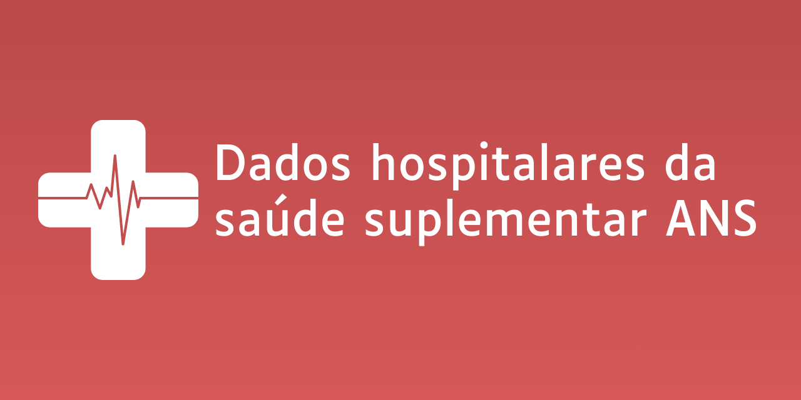

```{r setup, include=FALSE}
knitr::opts_chunk$set(echo = TRUE)
library(bslib)
library(htmltools)
library(bsicons)
```

----------




# Que dados estamos usando?

A **Agência Nacional de Saúde Suplementar (ANS)** é responsável por regular os planos de saúde no Brasil. Esta agência iniciou o **Plano de Dados abertos (PDA)**, que consiste em solicitar dados para divulgação pública com diversos propósitos, desde o acesso à informação por parte do público como também para ajudar na regulação por parte do próprio órgão.

O PDA possui dados para internações e procedimentos hospitalares e ambulatoriais, mas nesta análise serão tratados apenas os dados de origem hospitalar. A análise realizada aqui é feita a partir de um recorte aleatório de dados do **Padrão para Troca de Informação de Saúde Suplementar (TISS)** para todos os estados do Brasil, mas apenas ao longo do ano de 2019.

# Qual é o objetivo? {.tabset}

Este projeto foi desenvolvido de 2021 à 2022 com o *objetivo inicial* obter dados hospitalares de 2021 da ANS e desenvolver:

1. uma análise e;
2. um modelo de previsão de acionamentos de seguros.

Em 2024 este projeto recebeu um upgrade para torná-lo mais realista e completo, usando tecnologias mais avançadas e aplicando novos conhecimentos de análise e modelagem que adquiri durante este tempo. Além de aplicar novos conhecimentos, outro objetivo deste *remake* é abordar mais dos âmbitos da profissão de Cientista de Dados, adicionanado outras etapas posteriores às apresentadas antes:

3. Avaliar e acompanhar o desempenho do modelo com novos dados
4. Apresentação dos resultados

Sinta-se livre para navegar entre os materiais relevantes abaixo!

## Main

```{r vbs_main, echo = FALSE}
value_boxes <- list(
    value_box(
        title = "1ª Etapa",
        value = HTML("<a href='https://github.com/VFLins/hospitalar_data-pda-tiss/blob/main/collector_saude-pda-tiss-hosp-2019.py'>Coleta de dados</a>"),
        showcase = bs_icon("database-fill-down"),
        fill = FALSE,
        p("ETL (Extract, Transform, Load) nos dados da Troca de Informações da Saúde Suplementar (TISS) no período de 2019. Os dados estão presentes em servidores FTP e foram coletados e armazenados localmente em um banco de dados relacional.")
    ),

    value_box(
        title = "2ª Etapa",
        value = HTML("<a href='https://vflins.github.io/hospitalar_data-pda-tiss/eda.html'>EDA e Modelagem</a>"),
        showcase = bs_icon("code-square"),
        fill = FALSE,
        p("Análise Exploratória entendendo o comportamento das variáveis disponíveis. A partir disto pudemos desenvolver uma solução de Machine Learning com valor de negócio.")
    )
)

layout_column_wrap(
  width = "100%",
  card(!!!value_boxes)
)
```

----------

## Remake

```{r vbs_remake, echo = FALSE}
value_boxes <- list(
    value_box(
        title = "1ª Etapa",
        value = HTML("<a href='https://github.com/VFLins/hospitalar_data-pda-tiss/blob/main/collector_saude-pda-tiss-hosp-2019.py'>Coleta de dados</a>"),
        showcase = bs_icon("database-fill-down"),
        fill = FALSE,
        p("Dados coletados a partir do servidor FTP oficial, múltiplos arquivos .zip foram baixados e extraídos localmente, e em seguida armazenado em um Data Warehouse na nuvem.")
    ),

    value_box(
        title = "2ª Etapa",
        value = HTML("<a href='https://vflins.github.io/hospitalar_data-pda-tiss/eda.html'>EDA e Modelagem</a>"),
        showcase = bs_icon("code-square"),
        fill = FALSE,
        p("Análise Exploratória entendendo o comportamento das variáveis disponíveis. A partir disto pudemos desenvolver e avaliar uma solução de Machine Learning com valor de negócio.")
    ),

    value_box(
        title = "3ª Etapa",
        value = "Teste do modelo",
        showcase = bs_icon("check2-square"),
        fill = FALSE,
        p("Testar o modelo ajustado com a amostra no conjunto de dados mais abrangente e tirar conclusões sobre a sua performance.")
    ),

    value_box(
        title = "4ª Etapa",
        value = "Apresentação executiva",
        showcase = bs_icon("file-earmark-slides"),
        fill = FALSE,
        p("Apresentação de resultados e conquista para stakeholders relevantes para a solução desenvolvida.")
    )
)

layout_column_wrap(
  width = "100%",
  card(!!!value_boxes)
)
```

----------

# Sobre mim

Você pode querer ver [meus outros projetos](http://sites.google.com/view/vflins/), ou [artigos que tenho escrito](https://sites.google.com/view/vflins/artigos). Se quiser entrar em contato comigo, tente algum destes links:

<center>
    [Linkedin](https://linkedin.com/in/vflins) |
    [Email](mailto:vflins@live.com) |
    [Whatsapp](https://wa.me/558188788208)
</center>

----------
